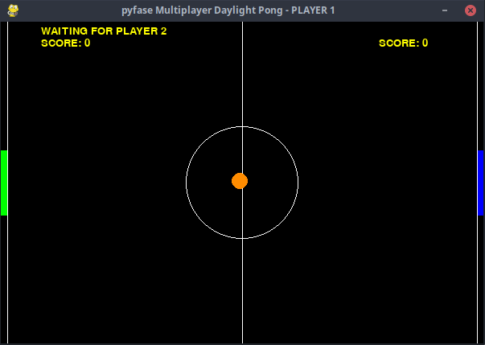
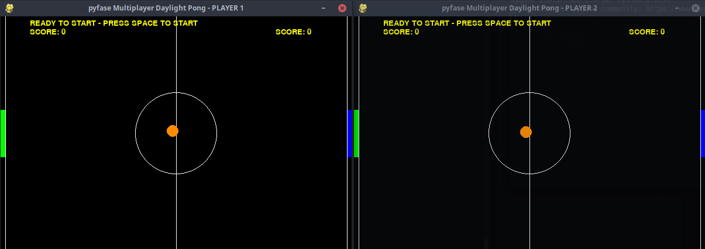
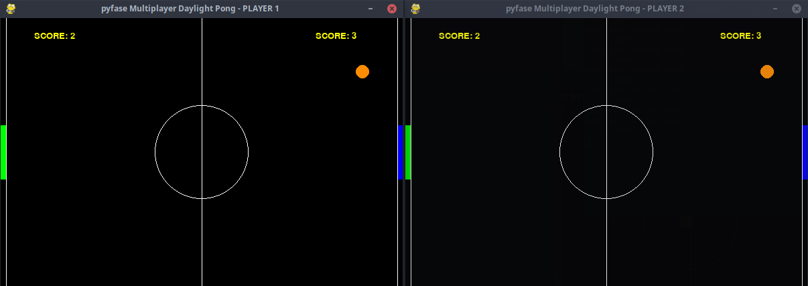
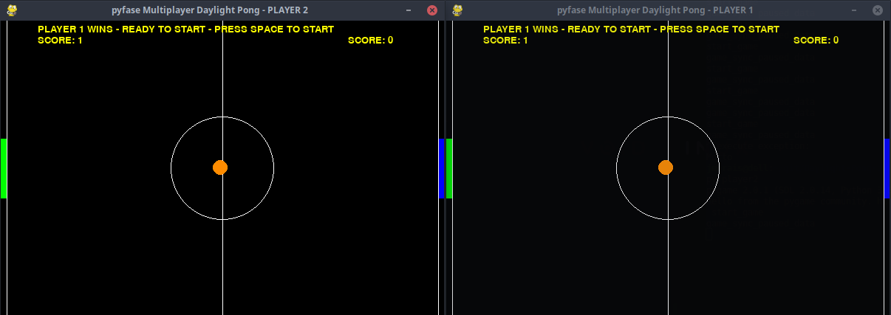

    

# pyfase Multiplayer Daylight Pong in Python 3

This is the Multiplayer version of the Original "Daylight Pong in Python 3" developed by Hamdy Abou El Anein


## What's this game ?

Pong is one of the earliest arcade video games. It is a table tennis sports game featuring simple two-dimensional graphics. The game was originally manufactured by Atari, which released it in 1972. Allan Alcorn created Pong as a training exercise assigned to him by Atari co-founder Nolan Bushnell. Bushnell based the idea on an electronic ping-pong game included in the Magnavox Odyssey, which later resulted in a lawsuit against Atari. Surprised by the quality of Alcorn's work, Bushnell and Atari co-founder Ted Dabney decided to manufacture the game.

Pong quickly became a success and was the first commercially successful video game, which helped to establish the video game industry along with the first home console, the Magnavox Odyssey. Soon after its release, several companies began producing games that copied Pong's gameplay, and eventually released new types of games. As a result, Atari encouraged its staff to produce more innovative games. The company released several sequels that built upon the original's gameplay by adding new features. During the 1975 Christmas season, Atari released a home version of Pong exclusively through Sears retail stores. It was also a commercial success and led to numerous copies. The game has been remade on numerous home and portable platforms following its release. Pong is part of the permanent collection of the Smithsonian Institution in Washington, D.C. due to its cultural impact. Pong has been referenced and parodied in multiple television shows and video games, and has been a part of several video game and cultural exhibitions.

# Play Multiplayer Over Internet or Local Network

## Waiting for player


## Ready to play


## GamePlay





## What you need to make it work :

This game is made for Python 3.  

Install all the packages for : Python 3.  


Install the last version of pygame :  

```sh
python3 -m pip install pygame pyfase pyzmq
```

## How to launch the game :

### for player 1 - The Host
```sh
python3 pyfaseMultiplayerDaylightPong.py player1
```  

### for player 2
```sh
python3 pyfaseMultiplayerDaylightPong.py player2
```  

## Commands :  

- Arrow UP = UP
- Arrow Down = DOWN
- Space = START


## DaylightPong Developer - Author

Hamdy Abou El Anein

## pyfase and Multiplayer - Author

Joaci Morais

